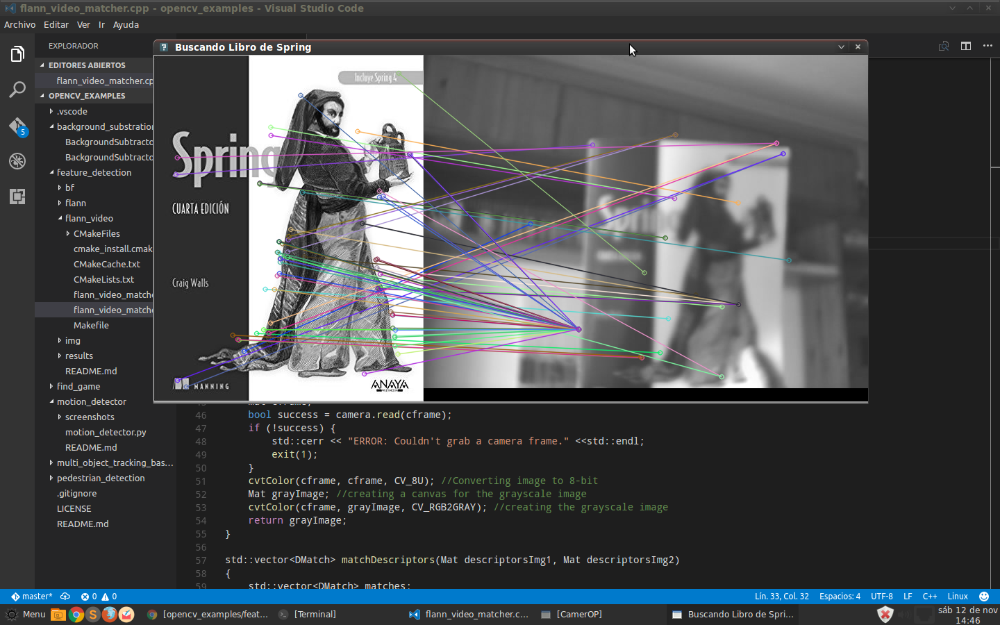
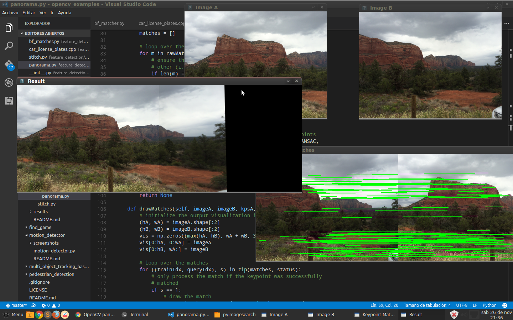

# Feature Detection

Brute-Force Matching with SURF Descriptors and Ratio Test

The result:

SURF Descriptors Matching with FLANN

The result:

Search Spring 4 Book with FLANN Matcher

The result:

Panorama stitching

Our panorama stitching algorithm consists of four steps:

Step #1: Detect keypoints (DoG, Harris, etc.) and extract local invariant descriptors (SIFT, SURF, etc.) from the two input images.
Step #2: Match the descriptors between the two images.
Step #3: Use the RANSAC algorithm to estimate a homography matrix using our matched feature vectors.
Step #4: Apply a warping transformation using the homography matrix obtained from Step #3.

The result:
